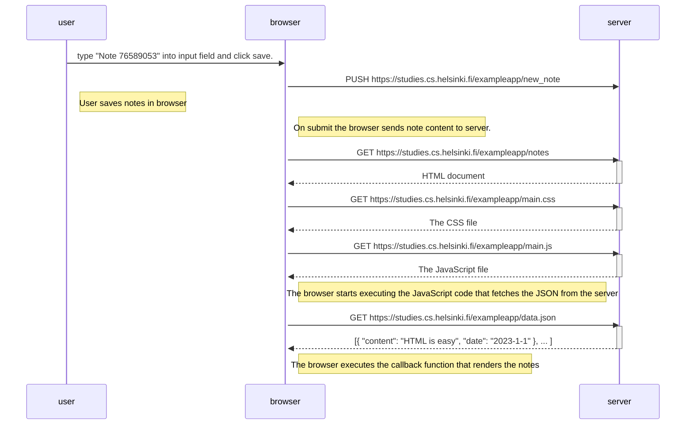

```mermaid
    sequenceDiagram
        participant user
        participant browser
        participant server

        user->>browser: type "Note 76589053" into input field and click save.
        activate browser
        browser->>server: PUSH https://studies.cs.helsinki.fi/exampleapp/new_note

        Note right of user: User saves notes in browser
        Note right of browser: On submit the browser sends note content to server.

        browser->>server: GET https://studies.cs.helsinki.fi/exampleapp/notes
        activate server
        server-->>browser: HTML document
        deactivate server

        browser->>server: GET https://studies.cs.helsinki.fi/exampleapp/main.css
        activate server
        server-->>browser: The CSS file
        deactivate server

        browser->>server: GET https://studies.cs.helsinki.fi/exampleapp/main.js
        activate server
        server-->>browser: The JavaScript file
        deactivate server

        Note right of browser: The browser starts executing the JavaScript code that fetches the JSON from the server

        browser->>server: GET https://studies.cs.helsinki.fi/exampleapp/data.json
        activate server
        server-->>browser: [{ "content": "HTML is easy", "date": "2023-1-1" }, ... ]
        deactivate server

        Note right of browser: The browser executes the callback function that renders the notes

```