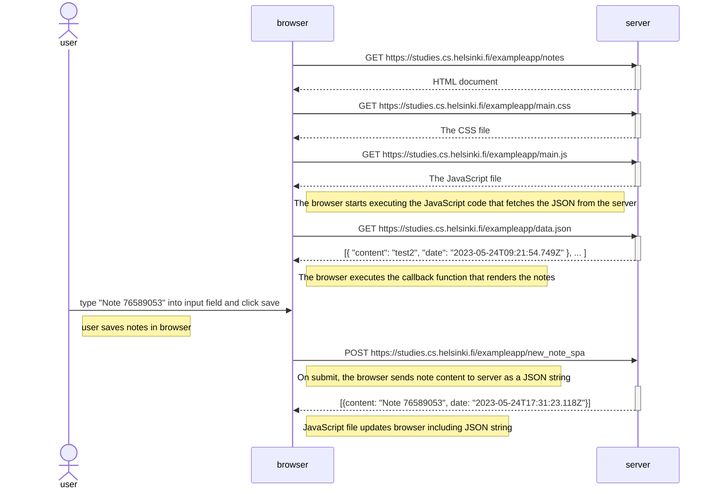

```mermaid
    sequenceDiagram
        actor user
        participant browser
        participant server

        browser->>server: GET https://studies.cs.helsinki.fi/exampleapp/notes
        activate server
        server-->>browser: HTML document
        deactivate server

        browser->>server: GET https://studies.cs.helsinki.fi/exampleapp/main.css
        activate server
        server-->>browser: The CSS file
        deactivate server

        browser->>server: GET https://studies.cs.helsinki.fi/exampleapp/main.js
        activate server
        server-->>browser: The JavaScript file
        deactivate server

        Note right of browser: The browser starts executing the JavaScript code that fetches the JSON from the server

        browser->>server: GET https://studies.cs.helsinki.fi/exampleapp/data.json
        activate server
        server-->>browser: [{ "content": "test2", "date": "2023-05-24T09:21:54.749Z" }, ... ]
        deactivate server

        Note right of browser: The browser executes the callback function that renders the notes

        user->>browser: type "Note 76589053" into input field and click save

        Note right of user: user saves notes in browser

        browser->>server: POST https://studies.cs.helsinki.fi/exampleapp/new_note_spa

        Note right of browser: On submit, the browser sends note content to server as a JSON string

        activate server
        server-->>browser: [{content: "Note 76589053", date: "2023-05-24T17:31:23.118Z"}]
        deactivate server

        Note right of browser: JavaScript file updates browser including JSON string 
```